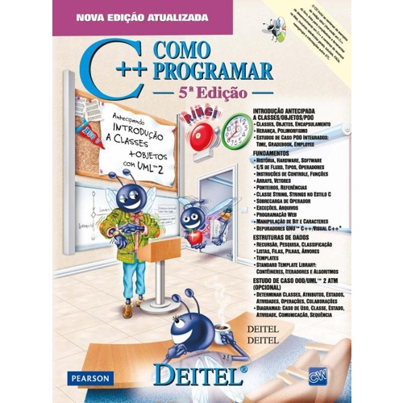

# cpp_como_programar
Exercícios do livro C++ Como Programa Deitel

<h1 align="right">
   
  
   
  C++ COmo Programa - 5ª Edição
   
</h1>

Neste repositório publicarei os exercícios resolvidos do livro C++ Como Programar do Deitel - 5ª Edição 
< p align="right">

Cada capítulo possuirá uma pasta separada com os exercícios em ordem e utilizando o comentário: figura x.xx